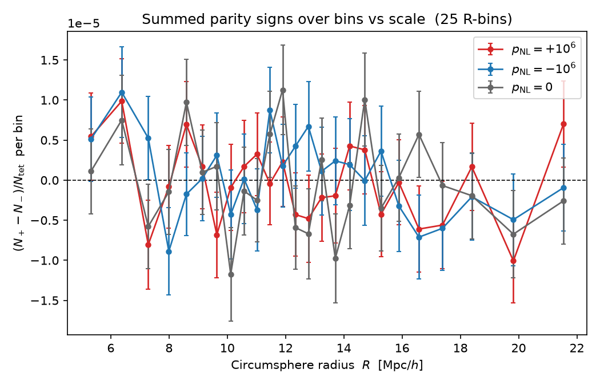
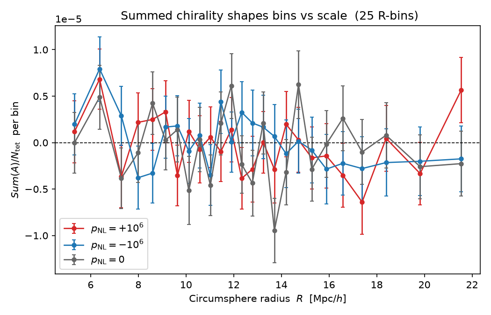

## Monday, August 10

- **Set up the `delaunay-parity` repo** on my machine (with a `README` and a `.gitignore`), linked my SSH key to my GitHub account, then:
  `git init` → `git add .` → `git commit -m "message"` → `git branch -M main` → `git remote add origin git@github.com:josue-aubert/<repo-name>.git` → `git push -u origin main` (afterwards a plain `git push` is enough).
- **Forked Cheng's `DIVE` repo** to my GitHub, then cloned it locally with `git clone git@github.com:josue-aubert/DIVE.git`.
- **Created a conda environment `delaunay-parity`** and installed the requirements from `environment.yml`, which contains the compilation dependencies listed in the *Compilation* section of DIVE's README plus my own Python stack.
- **Compiled DIVE** and built the executable with: `cgal_create_CMakeLists -s DIVE` → `cmake -DCMAKE_BUILD_TYPE=Release .` → `make`.
- **Two separate repos** in the end: `delaunay-parity` (the analysis project) and `DIVE` (my modified fork of the C++ tool).
- **Created a toy test set** and checked that the whole chain runs correctly.

## Tuesday, August 11

We need a definition of parity on the 4 points (galaxies) of a tetrahedron such that: it flips sign under a parity transformation, it does not depend on the observer's position, and it is invariant under rotation → the **scalar triple product**.

**Definition (this work):**
- For each vertex, sum the (squared, for simplicity) lengths of its three edges, and use this to order the vertices in **increasing** order. `r0` is the position of the vertex with the smallest (squared) edge-length sum, etc.
- Define `s_i = r_i - r_0`.
- The parity observable is the triple product `(s_1 × s_2) · s_3` (a pseudoscalar), equal to `det(s_1, s_2, s_3)`.

Inspired by *"Measurement of parity-odd modes in the large-scale 4-point correlation function of SDSS BOSS DR12 CMASS and LOWZ galaxies"*, J. Hou, Z. Slepian, R. N. Cahn — MNRAS 522, 5701 (2023), [arXiv:2206.03625](https://arxiv.org/abs/2206.03625). 

**Implementation:** coded this in `DIVE.cpp` (extra output column) and updated the README.

**Test (toy set):** for 500 random points in a box of side 1000, DIVE builds 3385 tetrahedra, of which **1680 have positive parity and 1705 negative**. The asymmetry is `A = N+ - N- = -25`. Under the null hypothesis of equiprobable signs, the standard deviation of `A` is `sqrt(N) = sqrt(3385) ≈ 58`, so the measurement is at `~0.4σ`, fully consistent with zero → the statistic is unbiased on parity-symmetric data.

### First run on Quijote

**Simulations (from the Quijote table).** Matched sets, all *standard / 2LPT / 512³*:
- `ODD_p`: pNL = +1e6, 500 realizations
- `ODD_m`: pNL = -1e6, 500 realizations
- `fiducial`: pNL = 0, 15,000 realizations (the first 500 share seeds with ODD)

**Data.** Downloaded one FoF halo catalog of each via Globus, at z=0. Watch the
redshift/snapshot mapping, it differs for ODD:
- fiducial: `/Halos/FoF/fiducial/10825/groups_004/` (snapnum 4 → z=0)
- ODD_p: `/Halos/FoF/ODD_p/310/groups_001/` (snapnum 1 → z=0 for ODD)
- ODD_m: `/Halos/FoF/ODD_m/310/groups_001/` (snapnum 1 → z=0 for ODD)

Read with Pylians' `readfof` (needs the structure `basedir/groups_XXX/group_tab_XXX.*`;
it stitches the sub-files automatically), extracted halo positions
`GroupPos/1e3` (Mpc/h) and saved them as `x y z` text files for DIVE.

**Results** (~4×10⁵ halos each, no mass cut for the moment):

| simulation | pNL   | N_tet    | N+       | N-       | A     | A/√N   |
|------------|-------|----------|----------|----------|-------|--------|
| fiducial   | 0     | 2757091  | 1377653  | 1379438  | -1785 | -1.1σ  |
| ODD_p      | +1e6  | 2751143  | 1376236  | 1374907  | +1329 | +0.8σ  |
| ODD_m      | -1e6  | 2752269  | 1376286  | 1375983  | +303  | +0.2σ  |


- **Null test passes** on the real fiducial: A = -1785 ≈ -1.1σ, consistent with zero.
- **Paired difference:** A(ODD_p) - A(ODD_m) = 1329 - 303 = **+1026**, with the
  expected sign (pNL>0 gives a more positive asymmetry).

## Wednesday, August 12

- **SSH to the Tsinghua server fixed:** it now works from any network with
  `ssh -p 1918 jaubert@chat.iastro.cn`.
- **Trying to bring the 500 z=0 realizations of each set** (fiducial, ODD_m, ODD_p)
  from the Quijote server to Tsinghua via Globus. Problem: each catalog is ~35 MB
  → ~50 GB total, and the download speed stays at 150–200 KB/s. Likely because the
  data is hosted in the US while we are in China, and possibly because each ODD_m /
  ODD_p catalog is split into ~128 small files (the huge number of files may slow
  the transfer).
- Meanwhile downloaded 4 realizations of each set to my own machine to validate
  the analysis. Wrote `test_on_four_each.py`, which applies DIVE to each simulation
  (~50 s per simulation).
- Wrote a first analysis script that reads the parity .txt files and prints, for
  each simulation, the number of positive-parity tetrahedra N+, the number of
  negative-parity tetrahedra N-, and their difference A = N+ - N- (a first statistic).

| set      | real | A     | N_tet    |
|----------|------|-------|----------|
| ODD_p    | 0    | 1068  | 2750194  |
| ODD_p    | 1    | 1107  | 2760341  |
| ODD_p    | 2    | -351  | 2747579  |
| ODD_p    | 3    | -1396 | 2759798  |
| ODD_m    | 0    | -39   | 2751233  |
| ODD_m    | 1    | 146   | 2763806  |
| ODD_m    | 2    | -102  | 2749048  |
| ODD_m    | 3    | -564  | 2760614  |
| fiducial | 0    | -199  | 2752961  |
| fiducial | 1    | -2206 | 2760996  |
| fiducial | 2    | 1013  | 2746501  |
| fiducial | 3    | -996  | 2758066  |

| set      | mean A  | std A  |
|----------|---------|--------|
| ODD_p    | 107.0   | 1047.9 |
| ODD_m    | -139.75 | 261.4  |
| fiducial | -597.0  | 1172.5 |

-> with only 4 realizations per set this is far too noisy to conclude, the full 500 realizations are needed.

## Thursday, August 13

- The data has been downloaded onto the Tsinghua server (thanks to Prof. Zhao), so
  the pipeline can now be tested directly on the server.
- Created a new test script `first_test_server.py` and updated `analysis.py` so that
  both take their paths as command-line arguments (input / output / DIVE path for the
  test script; input for the analysis script). For now the analysis script just prints
  to the terminal the number of tetrahedra found, the parity difference, and the
  means & standard deviations.
- Cloned this repo into `~/jaubert`, installed Miniconda, created the environment from
  the repo's `environment.yml` with `conda env create -f environment.yml`, and
  activated it.
- Cloned the DIVE repo and compiled it with `cmake -DCMAKE_BUILD_TYPE=Release .` then `make`.
- Ran a first test:
  `python first_test_server.py -i /data/users/czhao/Quijote/Halos/FoF -d /home/jaubert/DIVE/DIVE -o /data/users/jaubert/first_test_server_out -n 3`
  and `python analysis.py -i /data/users/jaubert/first_test_server_out`
  → the results are identical to those on my own machine: the pipeline is validated!
- Ran a test on 30 realizations using tmux  so the job keeps running on the server even after
  disconnecting the SSH : `tmux new -s parity` creates a session named "parity", `Ctrl-b` then `d` detaches it
  (the session keeps running in the background), `tmux attach -t parity` reattaches, and
  `tmux ls` lists the sessions.
- Modified the output script to stop keeping the position of the circumsphere centres,
  saving space (2 text columns instead of 5): ~160 MB -> ~45 MB per simulation.
- Modified the parity script so it can take `--start` and `--end` indices defining which
  realizations to process, and parallelized the work on the server across 25 cores. The
  full run (500 of each set, 1500 simulations) took about 2h20min:
```
    for c in $(seq 0 20 499); do
      end=$((c+20))
      python first_test_server.py -i /data/users/czhao/Quijote/Halos/FoF \
        -d ~/DIVE/DIVE -o /data/users/jaubert/parity_out \
        --start $c --end $end > ~/log_$c.txt 2>&1 &
    done
    wait
    echo "ALL DONE"
```

- Optimized `analysis.py` using `pd.read_csv(...).to_numpy()` instead of `np.loadtxt`
  (one read per file): analysis of the 1500 files dropped from a few hours to ~13 min.

- Ran the raw (unbinned) analysis on all 500 realizations of each set.

  **A = N+ − N-** (positive minus negative parity tetrahedra):

  | set      | mean A  | std A  |
  |----------|---------|--------|
  | ODD_p    | -23.76  | 1719   |
  | ODD_m    | 34.41   | 1756   |
  | fiducial | -19.63  | 1746   |

  Error on the mean = std/√500. Null test: fiducial = -19.6 ± 78 → -0.25σ ✓.
  Paired signal ⟨A_p − A_m⟩ = -58 ± ~110 → **-0.5σ**, not significant.

  **T = sum of signed volumes** (instead of signs):

  | set      | mean T  | std T |
  |----------|---------|-------|
  | ODD_p    | -103    | 6913  |
  | ODD_m    | -374    | 7089  |
  | fiducial | -291    | 6745  |

  Null: -291 ± 302 → -1.0σ. Paired signal ⟨T_p − T_m⟩ = +270 ± ~443 → **+0.6σ**, not significant.

- **Conclusion:** neither global statistic detects pNL (both consistent with zero, and
  opposite signs → noise). next step: bin by radius R and build a Fisher matrix.

## Friday, August 14

- Define the theoretical background behind the statistics.

### Fisher formalism
 
Probability of observing data $\vec d$ for a set of parameters $\vec\theta = \{\theta_1, \dots, \theta_n\}$ $\equiv$ likelihood $\mathcal L(\vec d, \vec\theta)$.
 
**Fisher information:**
 
$$F_{ij} = -\left\langle \frac{\partial^2 (\ln\mathcal L)}{\partial\theta_i\,\partial\theta_j} \right\rangle$$
 
$\to$ mean curvature of the log-likelihood around its maximum. A sharp peak $\Rightarrow$ highly informative data.
 
**Cramér–Rao bound:**
 
$$\mathrm{Cov}(\vec\theta) \ge F^{-1} \quad\Rightarrow\quad \sigma(\theta_i) \ge \sqrt{(F^{-1})_{ii}}$$
 
### Gaussian case
 
Assume $P(d) = \dfrac{1}{\sqrt{2\pi}\,\sigma}\exp\!\left(\dfrac{-(d-\mu)^2}{2\sigma^2}\right)$. For $\vec d$ independent, $\dim(\vec d) = K$:
 
$$P(\vec d) = \prod_{k=1}^{K} \frac{1}{\sqrt{2\pi}\,\sigma_k}\exp\!\left(\frac{-(d_k-\mu_k)^2}{2\sigma_k^2}\right)$$
 
$\to$ **General formula** (also valid if $C_{ij}\neq 0$):
 
$$P(\vec d) = \frac{1}{(2\pi)^{K/2}\,|C|^{1/2}}\exp\!\left(-\tfrac12(\vec d - \vec\mu)^\top C^{-1}(\vec d - \vec\mu)\right) \equiv \mathcal L(\vec d\,|\,\vec\theta)$$
 
because $\vec\mu = \vec\mu(\vec\theta)$, $\dfrac{\partial\vec d}{\partial\theta_i} = 0$, and $C \neq C(\vec\theta)$ (simplification $\to$ negligible).
 
$$\Rightarrow \ln\mathcal L = \text{const} - \tfrac12(\vec d - \vec\mu)^\top C^{-1}(\vec d - \vec\mu)$$
 
$$\frac{\partial(\ln\mathcal L)}{\partial\theta_i} = -\tfrac12\frac{\partial}{\partial\theta_i}\!\left(\vec r^\top C^{-1}\vec r\right) = -\tfrac12\left(-2\,\frac{\partial\vec\mu^\top}{\partial\theta_i}C^{-1}(\vec d - \vec\mu)\right) = \frac{\partial\vec\mu^\top}{\partial\theta_i}C^{-1}(\vec d - \vec\mu) \quad (C^{-1}\text{ sym.})$$
 
with $\vec r = \vec d - \vec\mu$. Second derivative:
 
$$\frac{\partial^2(\ln\mathcal L)}{\partial\theta_i\,\partial\theta_j} = \frac{\partial^2\vec\mu^\top}{\partial\theta_i\,\partial\theta_j}C^{-1}(\vec d - \vec\mu) - \frac{\partial\vec\mu^\top}{\partial\theta_i}C^{-1}\frac{\partial\vec\mu}{\partial\theta_j}$$
 
Taking the average, the first term vanishes since $\left\langle \dfrac{\partial^2\vec\mu^\top}{\partial\theta_i\,\partial\theta_j}C^{-1}(\vec d - \vec\mu)\right\rangle = \dfrac{\partial^2\vec\mu^\top}{\partial\theta_i\,\partial\theta_j}C^{-1}(\vec\mu - \vec\mu) = 0$:
 
$$\Rightarrow \left\langle \frac{\partial^2(\ln\mathcal L)}{\partial\theta_i\,\partial\theta_j}\right\rangle = -\left\langle \frac{\partial\vec\mu^\top}{\partial\theta_i}C^{-1}\frac{\partial\vec\mu}{\partial\theta_j}\right\rangle = -F_{ij}$$
 
### Our case
 
$\theta = p_{\rm NL}$, only one parameter.
 
**Data:** $\vec A = (A_1, \dots, A_K)$, $K$ = number of bins — defined **for one simulation!**

One possible example of A : for `ODD_p`, simulation 355: $d_8 = A_8 = N_+^{(8)} - N_-^{(8)}$

**Model:**
 
$$\langle A_k\rangle(p_{\rm NL}) \approx \alpha_k \cdot p_{\rm NL}, \qquad \vec\alpha = \frac{\partial\langle\vec A\rangle}{\partial p_{\rm NL}} \quad \text{(response vector)}$$
 
For a matched seed $r$: $A_{p,k}[r] = +\alpha_k P + \eta_k[r]$ and $A_{m,k}[r] = -\alpha_k P + \eta_k[r]$, so
 
$$D_k[r] = A_{p,k}[r] - A_{m,k}[r] = 2\alpha_k P \qquad (N = 500 = \text{ seeds})$$
 
$$\Rightarrow \text{per-bin estimator:}\quad \hat\alpha_k = \frac{1}{2P}\,\frac{1}{N}\sum_{r=1}^{N}\big(A_{p,k}[r] - A_{m,k}[r]\big)$$
 
**Covariance estimator:**
 
$$\hat C_{ij} = \frac{1}{N-1}\sum_{r=1}^{N}\big(A^{\rm fid}_i[r] - \bar A_i\big)\big(A^{\rm fid}_j[r] - \bar A_j\big), \qquad \bar A_i = \frac{1}{N}\sum_{r=1}^{N}A^{\rm fid}_i[r]$$
 
but $\hat C^{-1}$ is biased $\Rightarrow$ **Hartlap correction**: $\hat C_{\rm corr}^{-1} = \dfrac{N-K-2}{N-1}\,\hat C^{-1}$ (so we must have $N \gg K$).
 
**Fisher matrix** (here a scalar):
 
$$F = \hat{\vec\alpha}^\top \hat C_{\rm corr}^{-1}\,\hat{\vec\alpha}$$
 
$$\Rightarrow \text{constraint:}\quad \sigma(\hat p_{\rm NL}) = \frac{1}{\sqrt F}$$
 
**Best estimator of $p_{\rm NL}$** given a measurement $\vec A_{\rm obs}$:
 
$$\hat p_{\rm NL} = \frac{\hat{\vec\alpha}^\top \hat C_{\rm corr}^{-1}\,\vec A_{\rm obs}}{\hat{\vec\alpha}^\top \hat C_{\rm corr}^{-1}\,\hat{\vec\alpha}} = \frac{\hat{\vec\alpha}^\top \hat C_{\rm corr}^{-1}\,\vec A_{\rm obs}}{F}$$
 
$$\Rightarrow \text{detection iff}\quad \frac{|\hat p_{\rm NL}|}{\sigma(\hat p_{\rm NL})} = \frac{\big|\hat{\vec\alpha}^\top \hat C_{\rm corr}^{-1}\,\vec A_{\rm obs}\big|}{\sqrt F} \gtrsim 3\text{–}5$$
 
**Results**

- With A = N+ - N- and 1 bin :
Hartlap factor = 0.996   (n_real=500, nbins=1)
F = 2.7575e-16
sigma(pNL) = 6.0220e+07   (1sigma error on pNL, one box volume)
check: pNL_hat(ODD_p mean) = 8.170e+05   (should be ~+1e+06)

- With A = N+ - N- and 20 bin :
Hartlap factor = 0.958   (n_real=500, nbins=20)
F = 1.3653e-14
sigma(pNL) = 8.5583e+06   (1sigma error on pNL, one box volume)
check: pNL_hat(ODD_p mean) = 9.861e+05   (should be ~+1e+06)

- With A = N+ - N- and 25 bin :
Hartlap factor = 0.948   (n_real=500, nbins=25)
F = 1.7582e-14
sigma(pNL) = 7.5415e+06   (1sigma error on pNL, one box volume)
check: pNL_hat(ODD_p mean) = 1.072e+06   (should be ~+1e+06)

## Monday, August 17

Since the statistic `A = N+ - N-` does not detect the variation of pNL, I try alternatives.

- **Sum of parities (signed volumes) instead of sum of signs.** Created a new analysis script `analysis_bin_parities.py` (sum of the tetrahedra parities rather than their signs), and renamed the old one to `analysis_bin_signs.py`.

  T = sum of each tetrahedron's parity, **1 bin**:
```
  Hartlap factor = 0.996   (n_real=500, nbins=1)
  F = 3.9991e-16
  sigma(pNL) = 5.0006e+07   (1sigma error on pNL, one box volume)
  check: pNL_hat(ODD_p mean) = -7.621e+05   (should be ~+1e+06)
```
  T = sum of each tetrahedron's parity, **25 bins**:
```
  Hartlap factor = 0.948   (n_real=500, nbins=25)
  F = 1.4654e-14
  sigma(pNL) = 8.2609e+06   (1sigma error on pNL, one box volume)
  check: pNL_hat(ODD_p mean) = 9.057e+05   (should be ~+1e+06)
```
  → worse than the signs.

- **Normalized statistic** `A = (N+ - N-)/N_tet`.

  1 bin:
```
  Hartlap factor = 0.996   (n_real=500, nbins=1)
  F = 2.7488e-16
  sigma(pNL) = 6.0315e+07   (1sigma error on pNL, one box volume)
  check: pNL_hat(ODD_p mean) = 8.155e+05   (should be ~+1e+06)
```
  25 bins:
```
  Hartlap factor = 0.948   (n_real=500, nbins=25)
  F = 1.7605e-14
  sigma(pNL) = 7.5367e+06   (1sigma error on pNL, one box volume)
  check: pNL_hat(ODD_p mean) = 1.071e+06   (should be ~+1e+06)
```
  → sigma(pNL) = 7.5367e+06 instead of 7.5415e+06: slightly better, but negligible.

- Added a way to store the results and the bin edges in `analysis_bin_signs.py`.
- Added a script to plot `A(R)` (R = circumsphere radius of the tetrahedra) for the
  different cosmologies.



## Tuesday, August 18

- Modifié DIVE pour qu'il rajoute une troisième colonne au fichiers textes de sortie : la chirality shape, soit le volume signé (la parité comme définie avant) divisée par la somme des longueurs des cotés du tétraèdre depuis le sommet défini comme référence : des(s_1, s_2, s_3) / (|s_1| * |s_2| * |s_3|) / (Nombre de tétraèdres dans cette sim
- Lancé le script sur les 1500 simulations pour récrire la colonne chirality shape, parallélisme sur 25 coeurs comme la semaine passée.
- Créé un script python pour l'analyse des résultats avec shapes et adapté le script de plot. Résultat:
```
Hartlap factor = 0.948   (n_real=500, nbins=25)
F = 1.5940e-14
sigma(pNL) = 7.9206e+06   (1sigma error on pNL, one box volume)
check: pNL_hat(ODD_p mean) = 1.110e+06   (should be ~+1e+06)
```
Soit comparable mais meme un peu pire  à ce qu'on obtenait avant...



